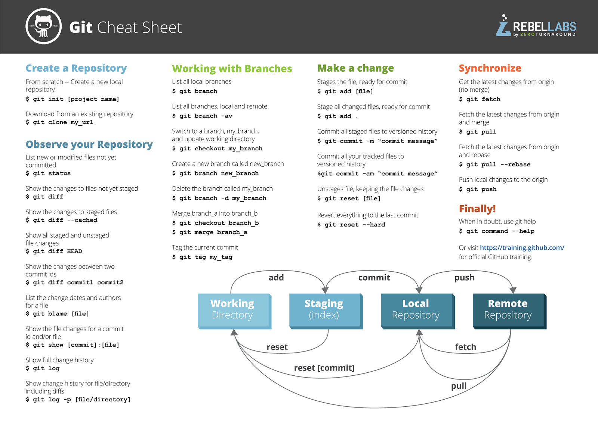
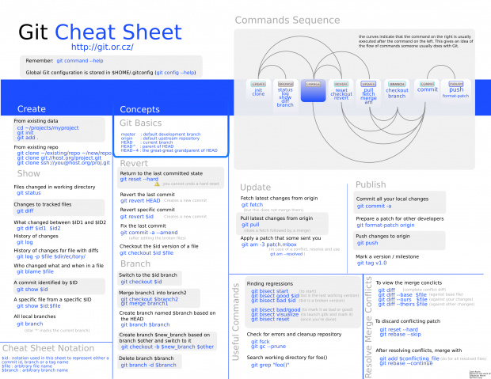
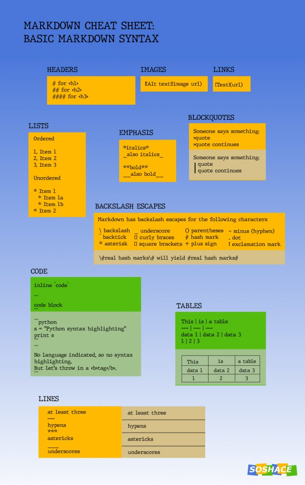

# cheat_sheet
#autres-themes-mkdocs

***Git***




## Markdown




## Autres thèmes MkDocs

https://github.com/mkdocs/mkdocs/wiki/MkDocs-Themes

[TOC]

Code dans le texte avec `a = 1`
 ````python
    a = 1
    print(a)
    ````
